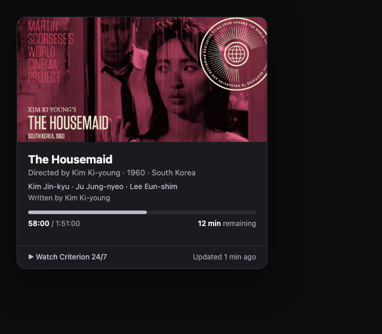
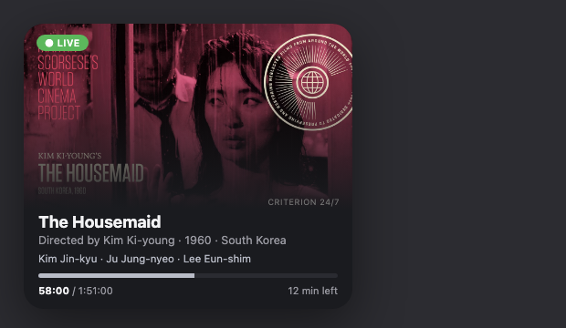
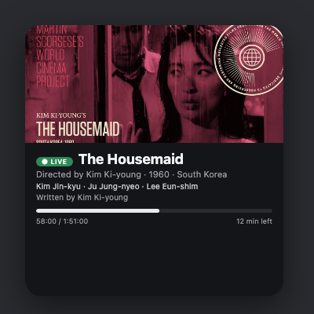
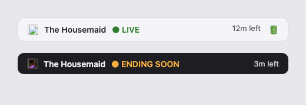

# Criterion24/7 Tracker

A macOS app + widgets that track what's playing **right now** on the
[Criterion Channel's 24/7 live feed](https://whatsonnow.criterionchannel.com/),
plus where we are in the current film.

> **Menu bar** — the source of truth, with a custom clapperboard icon.
> The **widgets** (medium + large) read its latest state and display it big.



  



## What it shows

- Current film **title**, **director**, **year**, **country of origin**
- **Top 3 cast** and **screenwriter**
- **Runtime** and a live **progress bar** (`elapsed / total`)
- A **poster / key frame** from the Criterion film page
- **Time remaining**; switches to an amber "ending soon" state in the last 5 minutes

## How it works

```
whatsonnow.criterionchannel.com   →  title · slug · minutes-until-next
        │  (polled every 10 min, or every 1 min in the final 5 min)
        ▼
criterionchannel.com/<film>       →  director · year · country · cast · poster
        ▼
Wikidata (keyless)                →  runtime · screenwriter   (TMDb optional)
        ▼
snapshot.json  ──▶  menu-bar app (source of truth)
        │
        └────▶  widget (medium + large) reads shared state and displays it big
```

- **Menu bar** is the source of truth and drives the refresh cadence.
- The **widget** is a display-only surface that reads the app's latest shared
  snapshot via an App Group, so it never needs to poll.
- Refresh cadence: **10 minutes** normally → **1 minute** when within **5 minutes**
  of the end of the current film (matching how often the feed meaningfully changes).

## Screenshots

Live screenshots are embedded at the top of this README. An annotated HTML
mockup covering the menu bar, both widget sizes, the finale ("ending soon")
state, and the offline state is kept at `Design/mockups.html`.

## Requirements

- macOS 15+ (Sonoma or later)
- Xcode 16+ (XcodeGen for project generation)
- Signed with an Apple development team for local run (see below)

## Metadata sources — **no API key required**

[Wikidata](https://www.wikidata.org/) supplies **runtime** and **screenwriter**
using its public, read-only SPARQL endpoint. No key, no account, nothing to
configure.

A [TMDb](https://www.themoviedb.org/) API key is **fully optional**. If you want
better coverage of obscure films (where Wikidata has thin data), set one:

1. Get a free key at themoviedb.org → Settings → API.
2. Save it to `~/.criterion247/tmdb.key` (plain text), **or**
   export `TMDB_API_KEY` in your environment.
3. Restart the app.

The app works without it — runtime/writer are simply omitted if neither source
has them, and progress still tracks via the Criterion countdown.

## Install

**Easiest (no Xcode, no developer team):**

```sh
# build + ad-hoc sign + install to /Applications with zero team setup
bash scripts/build.sh
```

That builds the app unsigned (ad-hoc signed) and installs it — **no Apple developer
team required**. The menu bar works fully this way. (On current macOS, an unsigned
widget may not register in the desktop/Notification Center; see the note below.)

**Build & run from Xcode (required for the widgets to work):**

```sh
brew install xcodegen        # if you don't have it
xcodegen generate            # in the repo root
open Criterion247.xcodeproj
```

- Set your **Development Team** (in project.yml: `DEVELOPMENT_TEAM`) so both the
  app and widget targets can be signed.
- Register the **App Group `group.dev.criterion247`** in your Apple Developer
  account (capabilities → App Groups) — required for app↔widget sharing.
- Select the `Criterion247` scheme and Run.

> **Widget tip:** on macOS 15+:
> 1. Right-click desktop → **Edit Widgets** (or click the date/time in the menu bar).
> 2. Search **"Criterion 24/7"** → add the Medium / Large widget.
> 3. The widget fetches live data itself (no key, no App Group needed), so it works
>    even standalone — but a signed build + App Group is recommended for reliability.

The data layer (`Data/CriterionData`) is a Swift package with a full test suite:

```sh
cd Data && swift test
```

## Project layout

```
project.yml                 XcodeGen project definition
App/                        Menu-bar app (source of truth)
Widget/                     WidgetKit extension (medium + large)
Data/CriterionData/         Swift package: parsers, Wikidata/TMDb clients, model
Data/Tests/                 Unit tests (feed, film page, enrichment, progress math)
Design/mockups.html         UI design mockups
```

## Privacy

- **No personal data** is uploaded or collected. The app reads public pages
  (Criterion feed + film page + Wikidata) and stores one local snapshot file.
- Any TMDb key you configure stays **on your machine** (`~/.criterion247/`,
  git-ignored) and is never sent anywhere but to TMDb's own API.
- The only outbound requests are to: `whatsonnow.criterionchannel.com`,
  `criterionchannel.com`, `query.wikidata.org`, `www.wikidata.org` (and
  `api.themoviedb.org` only if you configure a key).

## Disclaimer

This project is an independent, unofficial open-source tool. It is not
affiliated with, endorsed by, or connected to the Criterion Collection or the
Criterion Channel. Film metadata is sourced from the public Criterion "What's On
Now" page and Wikidata. Please use it respectfully and for personal tracking.

## License

MIT — see `LICENSE`.